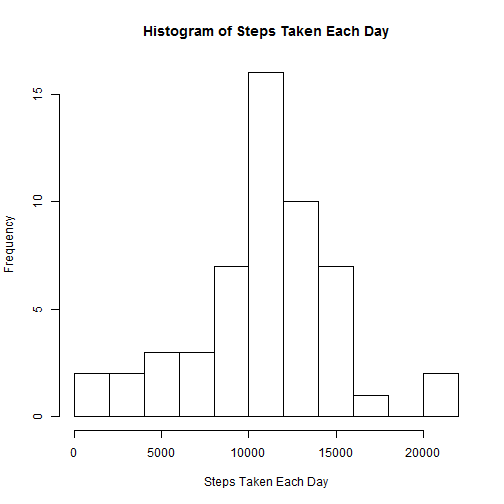

# Reproducible Research: Peer Assessment 1


## Loading and preprocessing the data
Show any code that is needed to

Load the data (i.e. read.csv())


```r
# Setting the working directory
setwd("C:/Users/Zhetong/Desktop/Coursera/Reproducible Research")

# Loading the csv in data frame
data <- read.csv("activity.csv")
```

## What is mean total number of steps taken per day?
For this part of the assignment, you can ignore the missing values in the dataset.

1.Make a histogram of the total number of steps taken each day.


```r
# Caculating the total number of steps taken each day
data1 <- tapply(data$steps, data$date, sum)

# Making a plot
hist(data1, main = "Histogram of Steps Taken Each Day", 
    xlab = "Steps Taken Each Day",breaks=15)
```

 

2.Calculate and report the mean and median total number of steps taken per day.


```r
# Calculating the mean and median
datamean <- mean(data1, na.rm = T)

datamedian <- median(data1, na.rm = T)
```

The mean of the total number of steps taken per day is 1.0766 &times; 10<sup>4</sup>, and the median of 
the total number of steps taken per day is 10765.

## What is the average daily activity pattern?
1.Make a time series plot (i.e. type = "l") of the 5-minute interval (x-axis) and the average number of steps taken, averaged across all days (y-axis)


```r
stepsAve <- tapply(data$steps, data$interval, mean, na.rm = T)
```


```r
plot(stepsAve,type = "l", col = "red", xlab = "5-minute interval", 
ylab = "Steps Averaged", main = "Steps Averaged Across All Days", frame = F)
```

 

2.Which 5-minute interval, on average across all the days in the dataset, contains the maximum number of steps?


```r
interval <- as.numeric(levels(factor(data$interval)))

stepsAve <- as.numeric(stepsAve)

stepsdata <- data.frame(interval, stepsAve)

max <- stepsdata[stepsdata[, 2] == max(stepsAve), ][ ,1]
```

The Maximum number of steps on average across all the days in the dataset is 835.


## Imputing missing values
Note that there are a number of days/intervals where there are missing values (coded as NA). The presence of missing days may introduce bias into some calculations or summaries of the data.

Calculate and report the total number of missing values in the dataset (i.e. the total number of rows with NAs)


```r
num <- sum(is.na(data$steps))
```

The total number of missing values in the dataset is 2304.

Devise a strategy for filling in all of the missing values in the dataset. The strategy does not need to be sophisticated. For example, you could use the mean/median for that day, or the mean for that 5-minute interval, etc.
Create a new dataset that is equal to the original dataset but with the missing data filled in.


```r
newdata <- data
for (i in 1:nrow(newdata)) {
    if (is.na(newdata[i, 1])) 
        newdata[i, 1] <- stepsdata[stepsdata[, 1] == newdata[i, 3], ][, 2]
}
```

Make a histogram of the total number of steps taken each day and Calculate and report the mean and median total number of steps taken per day. 


```r
newdata1 <- tapply(newdata$steps, newdata$date, sum)

hist(newdata1, main = "Histogram of Steps Taken Each Day", 
    xlab = "Steps Taken Each Day",col="blue", breaks=15)
```

 

Do these values differ from the estimates from the first part of the assignment? What is the impact of imputing missing data on the estimates of the total daily number of steps?


```r
# Calculating the mean and median
datamean <- mean(newdata1, na.rm = T)

datamedian <- median(newdata1, na.rm = T)
```

The mean of the total number of steps taken per day is 1.0766 &times; 10<sup>4</sup>, 
and the median of the total number of steps taken per day is 1.0766 &times; 10<sup>4</sup>. 
It shows no difference compared to first part of the assignment.


## Are there differences in activity patterns between weekdays and weekends?

For this part the weekdays() function may be of some help here. Use the dataset with the filled-in missing values for this part.

Create a new factor variable in the dataset with two levels ¨C ¡°weekday¡± and ¡°weekend¡± indicating whether a given date is a weekday or weekend day.


```r
Sys.setlocale(locale ="C")
```

```
## [1] "C"
```

```r
newdata2 <-newdata
day <- newdata2$date
day <-as.POSIXlt(day)
day <-weekdays(day)
daylevel <- vector()
for (i in 1:nrow(newdata2)) {
    if (day[i] == "Saturday") {
        daylevel[i] <- "Weekend"
    } else if (day[i] == "Sunday") {
        daylevel[i] <- "Weekend"
    } else {
        daylevel[i] <- "Weekday"
    }
}

newdata2$daylevel <- daylevel
newdata2$daylevel <- factor(newdata2$daylevel)

stepsByDay <- aggregate(steps ~ interval + daylevel, data = newdata2, mean)
names(stepsByDay) <- c("interval", "daylevel", "steps")
```

Make a panel plot containing a time series plot (i.e. type = "l") of the 5-minute interval (x-axis) and the average number of steps taken, averaged across all weekday days or weekend days (y-axis).


```r
library(lattice)
xyplot(steps ~ interval | daylevel, stepsByDay, type = "l", layout = c(1, 2), 
    xlab = "Interval", ylab = "Number of steps")
```

 

